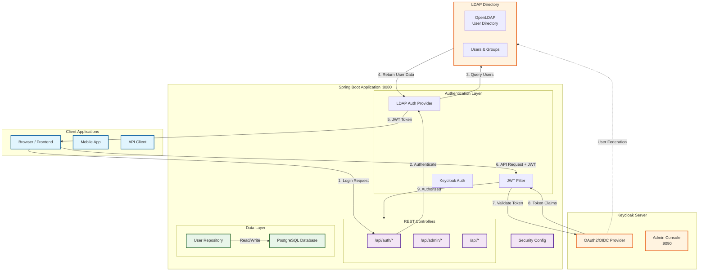

# Keycloak LDAP Demo

A Spring Boot application demonstrating **dual authentication** using **Keycloak** (OAuth2/OIDC) and **LDAP** for enterprise user management.

## Features

- **Keycloak Integration** — OAuth2/OIDC resource server with JWT validation
- **LDAP Authentication** — User authentication and group synchronization via LDAP
- **Role-Based Access Control** — JWT role conversion with Keycloak role mapping
- **Session Management** — Session blacklist for logout handling
- **PostgreSQL Database** — Persistent storage for user data

## Tech Stack

- Java 21
- Spring Boot 4.0.6
- Spring Security (OAuth2 Resource Server)
- Spring Data JPA
- Keycloak (latest)
- PostgreSQL 16
- LDAP (OpenLDAP via Docker)

## Quick Start

```bash
# Start all services
docker-compose up -d

# Run the Spring Boot application
./mvnw spring-boot:run
```

## Access Points

| Service | URL |
|---------|-----|
| Keycloak Admin Console | http://localhost:9090 (admin/admin) |
| Sample API Endpoints | http://localhost:8080/api/... |

## Project Structure

```
src/main/java/com/example/keycloak_ldap_demo/
├── config/          # Security configuration
├── controllers/     # REST API endpoints
├── dtos/            # Request/Response objects
├── model/           # JPA entities
├── repository/      # Data access layer
└── security/
    ├── keycloak/    # Keycloak JWT handling
    └── ldap/        # LDAP authentication
```

## Overview

This demo shows how to combine Keycloak's OAuth2 capabilities with LDAP's enterprise user directory in a single Spring Boot application.

## Architecture Diagram



### Flow Explanation

| Step | Description |
|------|-------------|
| **1-5** | **LDAP Authentication Flow**: Client sends login → Spring Boot queries LDAP directory → Returns JWT token |
| **6-9** | **Keycloak JWT Validation**: Client sends API request with JWT → Spring Boot validates token with Keycloak → Authorizes request |